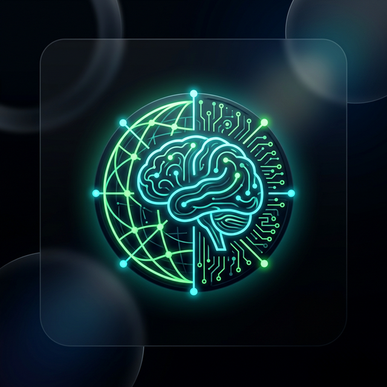
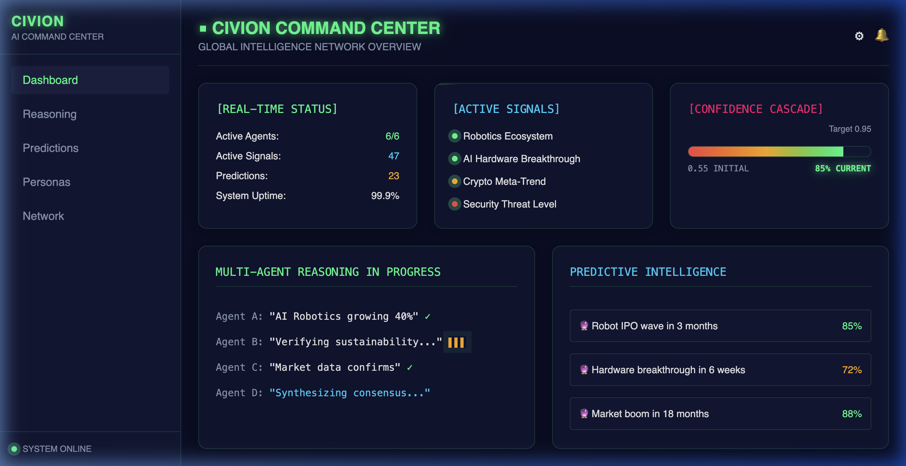
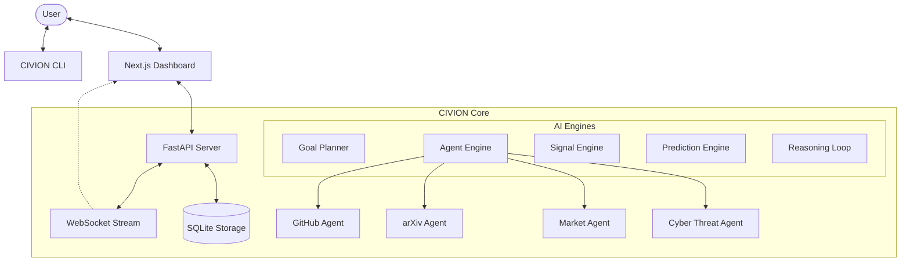

<div align="center">
  
  <h1>■ CIVION v2</h1>
  <p><b>Global AI Intelligence Command Center</b></p>

  [](https://opensource.org/licenses/MIT)
  [](https://www.python.org/)
  [](https://nextjs.org/)
  [](https://tailwindcss.com/)
</div>

---

## 🌟 Overview

**CIVION** is a production-grade, multi-agent intelligence platform designed for real-time global monitoring, reasoning, and predictive analytics. It orchestrates a swarm of specialized AI agents to synthesize insights from heterogeneous data sources—ranging from GitHub trends and market signals to cyber threat feeds and research papers.

Built with a **dark sci-fi aesthetic**, the platform provides a high-fidelity "Command Center" experience, combining glassmorphism, neon accents, and real-time data streaming through a robust FastAPI backend and an optimized Next.js frontend.

---

## 📸 Interface Preview

<div align="center">
  
  <p><i>The COMMAND CENTER dashboard featuring real-time status, active signals, and confidence cascade.</i></p>
</div>

---

## 🚀 Key Features

### 🤖 Intelligent Swarm
- **7+ Specialized Agents**: Dedicated agents for Research (arXiv), Code (GitHub), Markets (Crypto), Security (CVEs), Startups (HN), and more.
- **Concurrent Orchestration**: High-performance agent engine managing parallel data ingestion and analysis.
- **Mock Fallback**: Robust design ensuring UI stability even during API rate limits or outages.

### 🧠 Advanced Reasoning
- **Multi-Agent Debate**: A unique consensus loop where agents debate contradictory evidence to reach a high-confidence synthesis.
- **Confidence Cascade**: Probabilistic scoring system that tracks the evolution of intelligence from raw signals to verified insights.
- **Persona System**: Analyze data through custom lenses (e.g., "The Skeptic", "The Optimist") to uncover hidden patterns.

### 🔮 Predictive Intelligence
- **Automated Forecasting**: Engines that generate probabilistic predictions for market shifts and tech breakthroughs.
- **KPI Tracking**: Real-time accuracy monitoring with full verification history.

### 🛠 Modern Tech Stack
- **Backend**: FastAPI, Pydantic, Rich, Asyncio, SQLite.
- **Frontend**: Next.js 14 (App Router), Tailwind CSS, Framer Motion, Lucide React.
- **Workflow**: 60+ API endpoints, real-time WebSocket pub/sub, and a comprehensive CLI.

---

## 🏗 System Architecture



---

## 🚦 Quick Start

### 1. Installation

Ensure you have Python 3.10+ installed. It is recommended to use a virtual environment.

```bash
# Clone and install
git clone https://github.com/baljotchohan/CIVION.git
cd CIVION
pip install -e .

# Initial setup
civion setup
```

### 2. Launching the Command Center

CIVION manages both the backend and frontend. Simply run:

```bash
civion start
```

This will automatically:
1. Start the **FastAPI Intelligence Server**.
2. Start the **Next.js Command Dashboard**.
3. **Launch your browser** to the dashboard interface.

### 3. Maintenance

Keep your installation up to date with a single command:

```bash
civion update
```

---

## 🛡 License

This project is licensed under the MIT License - see the [LICENSE](LICENSE) file for details.

<div align="center">
  <p>Built with ❤️ by the CIVION Swarm</p>
</div>
